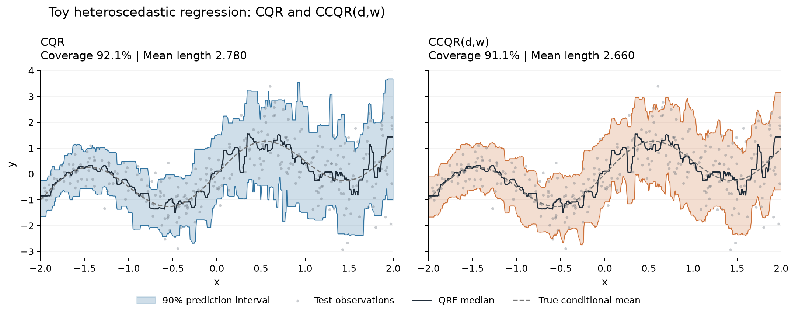

# Conformalized Composite Quantile Regression (CCQR)

`ccqr` constructs prediction intervals by combining conditional quantiles and
applying split-conformal calibration. It supports three selection modes:

| Method | `selection` | Selected parameters |
|---|---|---|
| CCQR(d) | `"d"` | Quantile range, with uniform weights |
| CCQR(w) | `"w"` | Quantile-pair weights at a fixed range |
| CCQR(d,w) | `"both"` | Quantile range and pair weights |

Selection uses out-of-fold predictions on the proper-training set. A separate
calibration set determines the final interval correction. Standard split CQR
is also available through `StandardCQR`.

## Installation

Requires Python 3.10 or later. Download or clone this repository, then run
from its root directory:

```bash
python -m pip install .
```

For the quantile random forest example below:

```bash
python -m pip install ".[examples]"
```

## Basic usage

Start with separate proper-training, calibration, and test sets. The example
uses `X_proper`, `y_proper`, `X_calibration`, `y_calibration`, and `X_test`.

```python
import numpy as np
from quantile_forest import RandomForestQuantileRegressor
from ccqr import ConformalLengthWeightedCQR, select_ccqr


def model_factory(seed):
    return RandomForestQuantileRegressor(
        n_estimators=500,
        min_samples_leaf=10,
        max_features=1.0,
        random_state=seed,
        n_jobs=-1,
    )


choice = select_ccqr(
    model_factory,
    X_proper,
    y_proper,
    bandwidths=np.arange(0.0, 0.41, 0.05),
    selection="both",
    K=5,
    n_quantiles=9,
    alpha=0.1,
    random_state=0,
)

final_model = model_factory(seed=0)
final_model.fit(X_proper, y_proper)

predictor = ConformalLengthWeightedCQR(
    final_model,
    lower_grid=choice["lower_grid"],
    upper_grid=choice["upper_grid"],
    weights=choice["weights"],
    alpha=0.1,
).calibrate(X_calibration, y_calibration)

intervals = predictor.predict(X_test)
```

`intervals` has shape `(n_test, 2)`, with lower and upper endpoints in its
columns. Use `selection="d"` to select only the range, or
`selection="w", d=0.4` to select weights at a fixed range.

`K` is the number of cross-fitting folds; `n_quantiles` is the number of
quantile pairs per nonzero range. `alpha=0.1` sets the nominal marginal coverage
to 90%. All selection modes return `bandwidth`, `lower_grid`, `upper_grid`,
`weights`, `objective`, `oof_qhat`, and per-candidate diagnostics in `candidates`.

## Toy example

The [toy notebook](examples/toy_ccqr.ipynb) generates heteroscedastic data and
compares CQR with CCQR(d,w) using a quantile random forest. It includes saved
outputs and the interval plot below.

```bash
python -m pip install -e ".[examples,notebook]"
python -m jupyterlab examples/toy_ccqr.ipynb
```

Run all cells to reproduce the example. It uses seed 0, with 1,000
proper-training, 1,000 calibration, and 5,000 test observations. Data are
generated in the notebook; no download is needed.



These results are from one simulated dataset. The nominal 90% coverage is
marginal, not conditional on each feature value.

## Base learners and selection

A model factory must return a fresh learner with these methods:

```python
model.fit(X, y)
model.predict(X, quantiles=[0.05, 0.10, 0.90, 0.95])
```

Predictions must have shape `(n_samples, n_quantiles)` and follow the requested
quantile order. The learner is fitted separately within each cross-fitting fold.

For existing OOF predictions, use `select_ccqr_from_oof`. It takes a prediction
matrix, quantile levels, and proper-training responses, with no fold-count
argument. Calibration uses the finite-sample split-conformal order statistic.

Weight optimization uses prefix-uniform initializations and eight
Dirichlet(1, ..., 1) starts, with up to 300 SLSQP iterations by default.
Joint candidate `i` uses optimizer seed `random_state + i` (zero-based).

## Tests

```bash
python -m pip install -e ".[test,examples]"
python -m pytest
```

A numerical comparison with a reference simulation is documented in
[REPRODUCIBILITY.md](REPRODUCIBILITY.md). Full experiment datasets and outputs
are not included in this repository.

## License

CCQR is distributed under the [MIT License](LICENSE). Third-party libraries
and external datasets remain subject to their own licenses and terms of use.
